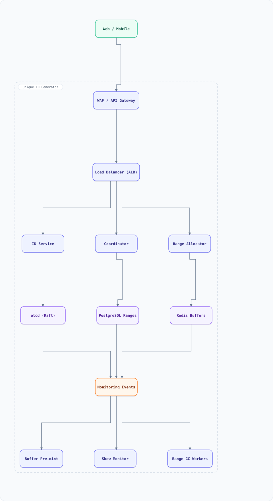

<div align="center">

# System Design: Unique ID Generator (Snowflake-style)

</div>

> [!TIP]
> **TL;DR** — Generate ~64-bit, roughly sorted, globally unique IDs at scale without a coordinating database sequence — the primitive behind order IDs, tweet IDs, and every primary key that must be minted thousands of times per second.

## Table of Contents

<details>
<summary><b>📑 Jump to a section</b></summary>

1. [Overview](#overview)
2. [Requirements](#requirements)
3. [High-Level Architecture](#high-level-architecture)
4. [Microservices](#microservices)
5. [Database Design](#database-design)
6. [Scaling Tiers](#scaling-tiers)
7. [Key Techniques & Patterns](#key-techniques--patterns)
8. [Key Design Decisions](#key-design-decisions)
9. [Failure Modes & Recovery](#failure-modes--recovery)
10. [Cost Estimation (1M Users)](#cost-estimation-1m-users)
11. [Trade-off Analysis](#trade-off-analysis)
12. [Key Metrics to Monitor](#key-metrics-to-monitor)
13. [Deep Dive Prompts](#deep-dive-prompts)
14. [Common Interview Follow-ups](#common-interview-follow-ups)
15. [Low-Level Design (LLD) - Algorithms & Data Structures](#low-level-design-lld---algorithms--data-structures)
16. [Do's & Don'ts](#dos--donts)

</details>

---


## Overview

A service that hands out unique 64-bit IDs to any caller (services, edge nodes) at very high rates. Twitter's Snowflake is the canonical design: timestamp + machine ID + per-machine sequence, so thousands of nodes mint IDs independently with no coordination.

### Key Numbers

| Metric | Value |
| :--- | :--- |
| **IDs generated** | 10K–100K per second, per cluster |
| **Per node** | 4,096 IDs/ms (12-bit sequence) |
| **ID width** | 64 bits (fits BIGINT) |
| **Ordering** | k-monotonic (roughly time-sorted) |

---

## Requirements

### Functional Requirements

- Issue globally unique 64-bit IDs
- IDs roughly sort by creation time (so B-tree inserts stay append-mostly)
- Support many independent issuing nodes
- Optional: reserved bits for shard/route hints

### Non-Functional Requirements

| Attribute | Target |
| :--- | :--- |
| **Latency** | < 1ms per ID (no network hop in the happy path) |
| **Availability** | 100% for issuance — ID generation must never be the bottleneck |
| **Uniqueness** | Absolute: a duplicate ID breaks every downstream FK |
| **Lifetime** | ~69 years of timestamps before bit exhaustion |

---

## High-Level Architecture

### Architecture Diagram



**Interactive diagram:** [diagrams/system-design/unique-id-generator.architecture.html](diagrams/system-design/unique-id-generator.architecture.html) — pan/zoom, search, dark/light theme, PNG/SVG export.


### Data Flow

1. Each ID node boots with a unique `machine_id` (assigned by a coordinator or derived from instance metadata)
2. Node reads its wall clock; if it equals the last millisecond, increment the 12-bit sequence
3. If sequence overflows (4,096 IDs in one ms), spin/stall until the next ms
4. If clock moves **backwards** (NTP correction), refuse to mint until it catches up — or hand out from a pre-generated buffer
5. Assemble: `(timestamp << 22) | (machine_id << 12) | sequence`
6. Caller gets the ID inline — no DB, no lock, no network

## Microservices

| Service | Tech Stack | Database | Pattern |
| --------- | ------------ | ---------- | ---------- |
| ID Service | Go / Rust (no GC pauses) | none (stateless) | Snowflake |
| Coordinator (machine-ID lease) | Java | ZooKeeper / etcd | Leases |
| Range Allocator (UUIDv7 / DB option) | Java | PostgreSQL (ranges) | Segment allocation |

---

## Database Design

### No database for minting (that's the point)

```
Snowflake 64-bit layout
  1 bit  sign (always 0)
  41 bit timestamp_ms since custom epoch   (~69 years)
  10 bit machine_id                        (1024 nodes)
  12 bit sequence per ms                   (4096 IDs/ms/node)
```

### Coordinator store (only for machine-ID assignment)

```
znode: /ids/nodes/node-<instance-id>  -> ephemeral lease with machine_id
table: id_ranges (only for the range-based variant)
  allocator | range_start | range_end | assigned_at
```

---

## Scaling Tiers

| Tier | Users | Infrastructure | Monthly Cost |
| ------ | ------- | --------------- | ------------- |
| 1K-10K | 10K | UUIDv4/UUIDv7 in app code, no service | $0 |
| 10K-1M | 1M | 2 ID nodes + one-time coordinator | $50 |
| 1M-10M+ | 10M+ | 32 ID nodes + 3-node etcd for leases | $500 |

---

## Key Techniques & Patterns

- **Snowflake bit-packing**: timestamp + machine + sequence in one 64-bit word
- **Machine-ID leases**: ephemeral znodes/etcd leases guarantee node uniqueness
- **Clock-skew guard**: refuse/stall on backwards clock; NTP in "slew" mode
- **Pre-generated buffers**: each node pre-mints a block on startup to absorb spikes
- **Base62/Snowflake IDs**: encoding for URLs (`concepts` §70)
- **Optimistic Concurrency**: range allocator hands out segments without 2PC

---

## Key Design Decisions

1. **No coordination in minting path**: uniqueness from bit layout, not from a lock
2. **41-bit timestamp**: 69-year lifetime beats 64-bit microseconds (294K years but harder to sort)
3. **10-bit machine ID**: 1,024 nodes is plenty; re-leasing after recycling needs care (IDs from a restarted node with stale clock must be rejected)
4. **Roughly-sorted IDs**: B-tree inserts stay right-most, avoiding page splits and write amplification
5. **Stateless nodes**: scale issuance by adding nodes, never shard data

---

## Failure Modes & Recovery

| Failure | Impact | Mitigation |
| --------- | -------- | ----------- |
| Clock skew backwards | Duplicate/unordered risk | Refuse to mint until catch-up; alert |
| Machine-ID lease expires | Two nodes mint same machine_id | Fencing token; coordinator double-checks |
| Coordinator down | No NEW nodes can join | Existing nodes unaffected; run 3-node quorum |
| Node crash mid-ms | Lost IDs (gaps) — fine | Gaps are harmless; no caller retries by ID |
| NTP step after drift | Sequence gaps | Accept monotonic-with-gaps guarantee |

---

## Cost Estimation (1M Users)

| Component | Configuration | Monthly Cost |
| ----------- | -------------- | ------------- |
| ID Nodes (2) | t4g.nano | $10 |
| etcd (3) | t4g.micro | $45 |
| Monitoring | Prometheus | $20 |
| **Total** | | **~$75** |

---

## Trade-off Analysis

| Decision | Option A | Option B | Choice | Why |
| ---------- | ---------- | ---------- | -------- | ----- |
| Uniqueness source | Central sequence (DB) | Bit-packing (Snowflake) | Snowflake | No coordination, no hotspot |
| Ordering | Strictly monotonic | Roughly monotonic | Roughly | Strict needs consensus per ID |
| Node identity | Static config | Coordinator lease | Lease | Autoscaling-safe |
| Overflow policy | Wait next ms | Steal bits from timestamp | Wait | Simpler; bursts < 1ms are rare |
| 128-bit option | UUIDv7 | Snowflake 64 | Snowflake | Fits BIGINT indexes |

---

## Key Metrics to Monitor

1. IDs minted / second per node
2. Sequence overflow events per ms (capacity alarm)
3. Clock skew events (any occurrence is an incident)
4. Machine-ID lease renewal failures
5. Mint latency P99 (< 1ms)
6. Gap density in minted IDs (should be tiny)
7. Coordinator availability

---

## Deep Dive Prompts

1. How would you guarantee *strictly* increasing IDs across nodes? (Vector-clock / consensus trade-off)
2. How would you migrate 10B existing auto-increment rows to Snowflake IDs?
3. Design an ID scheme that encodes the shard number for routing-free lookups.
4. What breaks if two datacenters mint IDs independently? (machine-id partitioning per region)
5. How do you handle the 2038/2069 bit exhaustion — rolling epochs?

---

## Common Interview Follow-ups

1. Why not just use UUIDv4? (128 bits, unsortable, wrecks B-tree locality)
2. What happens during a leap second or NTP step?
3. How many IDs can 1,024 nodes mint before the 41-bit epoch runs out?
4. How do you prevent ID prediction/enumeration for public URLs? (Blow off low bits, or use a separate secret-mixed variant)
5. Compare with Firestore-style push IDs and ULIDs.

---

## Low-Level Design (LLD) - Algorithms & Data Structures

### Snowflake ID Minting with Clock-Skew Guard

```text
class Snowflake {
  constructor(machineId, epoch = 1704067200000) { // 2024-01-01
    this.machineId = BigInt(machineId) & 1023n;   // 10 bits
    this.epoch = BigInt(epoch);
    this.lastMs = 0n;
    this.seq = 0n;
  }

  next() {
    let now = BigInt(Date.now()) - this.epoch;
    if (now < this.lastMs) throw new Error("clock went backwards by " + (this.lastMs - now) + "ms");
    if (now === this.lastMs) {
      this.seq = (this.seq + 1n) & 4095n;         // 12-bit sequence
      if (this.seq === 0n) {                       // overflow: busy-wait next ms
        while (BigInt(Date.now()) - this.epoch <= this.lastMs) {}
        now = BigInt(Date.now()) - this.epoch;
      }
    } else this.seq = 0n;
    this.lastMs = now;
    return (now << 22n) | (this.machineId << 12n) | this.seq;
  }
}

const sf = new Snowflake(7);
const a = sf.next(), b = sf.next();
console.log("IDs:", a.toString(), b.toString(), "sorted:", a < b);
```

### Clock-Drift Guard (production Snowflake hardening)

A real Snowflake deployment sits on NTP-synced VMs, and clocks **do** step backwards (leap smears, VM migration, bad NTP peer). An ID minted *before* an earlier ID breaks the monotonic guarantee every sort-by-id depends on.

```js
class DriftGuardedIdMinter {
  constructor(workerId, epoch = 1288834974657) {
    this.workerId = workerId;        // 10 bits
    this.epoch = epoch;
    this.lastTs = -1;
    this.seq = 0;                    // 12 bits
  }
  next() {
    let ts = Date.now();
    if (ts < this.lastTs) {
      // clock stepped back: refuse to go backwards — stall until we re-reach lastTs
      // real deployments also ALERT here (NTP jumped) and stop the mint loop
      const drift = this.lastTs - ts;
      if (drift > 50) throw new Error(`clock drift ${drift}ms — halting mint (check NTP)`);
      ts = this.lastTs;
    }
    if (ts === this.lastTs) {
      this.seq = (this.seq + 1) & 0xFFF;          // 4096 ids per ms per worker
      if (this.seq === 0) {                        // rollover: busy-wait the remainder ms
        while (Date.now() <= this.lastTs) { /* spin <= 1ms */ }
        ts = Date.now();
      }
    } else {
      this.seq = 0;
    }
    this.lastTs = ts;
    return ((ts - this.epoch) << 22) | (this.workerId << 12) | this.seq;
  }
}
const m = new DriftGuardedIdMinter(7);
const ids = Array.from({ length: 5000 }, () => m.next());
console.log(ids.every((v, i) => i === 0 || v > ids[i - 1])); // true — strictly monotonic
```

The guard converts "clock went backwards" from silent duplicate/unordered IDs into an explicit, alertable stall — the difference between a *weird bug* and an *incident with a dashboard*.

## Do's & Don'ts

| ✅ Do | ❌ Don't |
| :-- | :-- |
| Pin down the key numbers before drawing boxes | Don't hand-wave the hardest component — unique id generator lives or dies there |
| Justify the functional requirements choice against one alternative out loud | Don't default to the trendiest store without a consistency/scale argument |
| State the failure mode of non-functional requirements explicitly (what breaks first?) | Don't present a sunny-day design only — the follow-up question is always "and when it fails?" |
| Anchor capacity numbers before proposing shards/replicas | Don't introduce a component you can't cost or size with the numbers on the board |

*More cross-topic rules: [Interview Q&A §81](interview-qa.md#81-universal-dos--donts) · Concepts: [Networking](networking.md) · [Operating Systems](operating-systems.md)*

---

<nav>← [uber](system-design-uber.md) · [📖 All guides](README.md) · [url shortener](system-design-url-shortener.md) →</nav>
