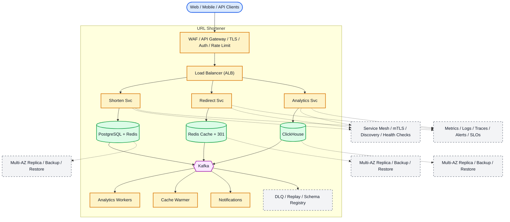

# System Design: URL Shortener (bit.ly)

## Overview

A URL shortening service that converts long URLs to short, shareable links with analytics tracking.

### Key Numbers

- 100M+ URLs shortened per day
- 10B+ redirects per day
- 100:1 read/write ratio

---

## Requirements

### Functional Requirements

- Shorten long URL to short URL
- Redirect short URL to original
- Support custom aliases
- Track click analytics
- Set expiration time

### Non-Functional Requirements

- Latency: Redirect < 50ms
- Throughput: 100M+ URLs/day
- Availability: 99.99% uptime
- Consistency: Strong for URL mapping
- Scale: 500M+ unique URLs

---

---

---

## High-Level Architecture

### Architecture Diagram



*Solid = data flow, dashed = control plane / monitoring.*

### Data Flow

1. User submits long URL - Shorten Service generates Base62 ID
2. ID from pre-generated counter (Distributed ID Generator)
3. Long URL + metadata stored in PostgreSQL + Redis cache
4. Short URL redirect - Redirect Service looks up Redis (sub-ms)
5. Cache miss - PostgreSQL fallback + cache for next time
6. 301 redirect for SEO, 302 for analytics tracking
7. Kafka events: click, referrer, geo - Analytics

## Microservices

### 1. URL Service

- **Responsibility**: URL creation, validation, custom aliases, expiry
- **Tech**: Go / Node.js
- **DB**: PostgreSQL (URL mappings)
- **Cache**: Redis (hot URLs)

### 2. Redirect Service

- **Responsibility**: URL redirection, analytics tracking, bot detection
- **Tech**: Go (high performance)
- **Cache**: Redis (redirect cache)

### 3. Analytics Service

- **Responsibility**: Click tracking, geographic data, device info, referral tracking
- **Tech**: Python / Flink
- **DB**: ClickHouse (OLAP), Kafka (event stream)

---

## Database Design

### PostgreSQL

```sql
CREATE TABLE urls (
    id              BIGSERIAL PRIMARY KEY,
    short_code      VARCHAR(10) UNIQUE NOT NULL,
    original_url    TEXT NOT NULL,
    user_id         UUID,
    created_at      TIMESTAMP DEFAULT NOW(),
    expires_at      TIMESTAMP,
    click_count     BIGINT DEFAULT 0
);

CREATE INDEX idx_short_code ON urls(short_code);
```

### Redis

```redis
# URL cache (hot URLs)
SETEX url:{short_code} 86400 {original_url}

# Click counter
INCR url:{short_code}:clicks
```

---

## Scaling Tiers

### Tier 1: 1K - 10K Users

| Component | Choice |
| ----------- | -------- |
| **Compute** | 2 EC2 (t3.large) |
| **Database** | PostgreSQL RDS |
| **Cache** | Redis (single) |
| **Queue** | Redis Streams |

### Tier 2: 10K - 1M Users

| Component | Choice |
| ----------- | -------- |
| **Compute** | ECS (10-20 containers) |
| **Database** | PostgreSQL (sharded by short_code) |
| **Cache** | Redis Cluster (6 nodes) |
| **Queue** | Kafka (3 brokers) |

### Tier 3: 1M - 10M+ Users

| Component | Choice |
| ----------- | -------- |
| **Compute** | Multi-region K8s (100+ pods) |
| **Database** | PostgreSQL (Citus sharding) + Cassandra |
| **Cache** | Redis Cluster (30+ nodes) |
| **CDN** | Multi-CDN (redirect at edge) |

---

## Key Design Decisions

### 1. Base62 Encoding (Short Code Generation)

```text
function generate_short_code(url) {
  // Hash the canonical URL, then encode the first 7 Base62 characters.
  hash = sha256(url)
  return base62_encode(hash).slice(0, 7)
}
```

### 2. Counter-Based Generation (Distributed)

```text
class CounterBasedGenerator {
    // Distributed counter for unique short codes
    // - Each server gets a unique ID range
    // - No collisions between servers
  next_code() {
    id = counter_store.increment_and_get()
    return base62_encode(id)
  }
}
```

### 3. Read-Through Cache

```text
function redirect(short_code) {
    // - Cache miss: query DB, populate cache
  url = cache.get(short_code)
  if (url == null) {
    url = database.get(short_code)
    if (url == null) return http_response(404)
    cache.set(short_code, url, ttl=3600)
  }
  queue.publish("url.click", { "short_code": short_code })
  return http_redirect(url)
}
```

### 4. Analytics Pipeline

```text
function track_click(short_code, request) {
    // Async click tracking pipeline
    // - Don't block redirect response
  event = {
    "short_code": short_code,
    "timestamp": current_unix_timestamp(),
    "ip": request.remote_addr,
    "user_agent": request.headers.get("user-agent")
  }
  analytics_queue.publish("url.clicks", event)
}
```

### 5. URL Expiry (TTL)

```text
function check_url_expiry(short_code) {
    // URLs can have optional expiry
    // - Check on redirect
    // - Background job cleans expired URLs
  record = database.get(short_code)
  if (record == null) return false
  if (record.expires_at != null && record.expires_at <= now()) {
    cache.delete(short_code)
    database.delete(short_code)
    return false
  }
  return true
}
```

---

---

## Failure Modes & Recovery
What can go wrong in production, and how the system detects and recovers:

| Failure | Impact | Recovery |
| --------- | -------- | ---------- |
| ID generator exhaustion | No more short URLs | Multi-shard counter, auto-scale ranges |
| Redis cache miss storm | All redirects hit DB | CDN for popular URLs, local cache |
| DNS propagation delay | New URL not resolving | Edge caching, DNS pre-warming |
| Analytics lag | Click counts not updating | Async via Kafka, batch aggregation |
| Duplicate URL creation | Same URL gets multiple shorts | Hash-based dedup, custom aliases override |
| Spam URL abuse | Platform used for phishing | URL scanning, user reporting, blocklist |

---

## Cost Estimation (1M Users)
Rough monthly cost of running this design for one million users:

| Component | Specification | Monthly Cost |
| ----------- | -------------- | ------------- |
| API Servers | 10x c5.xlarge | $1,400 |
| PostgreSQL | db.r5.xlarge + 3 replicas | $4,800 |
| Redis Cluster | 6x cache.r5.xlarge | $4,800 |
| Kafka (analytics) | 3x kafka.m5.large | $1,200 |
| CDN | 50TB/month (redirects) | $4,000 |
| Analytics Workers | 5x c5.large | $700 |
| **Total** | | **~$16,900/month** |

---

## Trade-off Analysis
The alternatives considered, and which one won and why:

| Approach A | Approach B | Winner | Reason |
| ----------- | ----------- | -------- | -------- |
| Base62 | MD5 hash | Base62 | Shorter, URL-safe, no special characters |
| Snowflake ID | UUID | Snowflake | Monotonically increasing, better for B-tree |
| Redis cache | Database only | Redis | Sub-ms redirect lookups |
| PostgreSQL | MySQL | PostgreSQL | Better JSON support for analytics |
| Bloom filter | HashSet for dedup | Bloom filter | Memory-efficient, 1% false positive rate |

---

## Key Metrics to Monitor
The metrics that signal system health, with alert thresholds:

| Metric | Description | Target |
| -------- | ------------- | -------- |
| **Redirect Latency** | Time to resolve short URL to original | < 5ms (p99) |
| **Cache Hit Rate** | % of redirects served from Redis | > 99% |
| **Short Code Collision Rate** | Duplicate codes generated | 0% |
| **URLs Created/sec** | Write throughput | Monitored |
| **Click-through Rate** | Analytics tracking accuracy | 100% |
| **URL Expiry Accuracy** | Expired URLs correctly blocked | 100% |
| **Base62 Decode Errors** | Invalid short codes received | < 0.01% |
| **Database Lag** | Replication delay for new URLs | < 100ms |
| **CDN Cache Hit** | % of redirects from CDN edge | > 80% |
| **Bloom Filter FP Rate** | False positive rate for duplicates | < 1% |

## Deep Dive Prompts

- How does Base62 encoding generate short URLs?
- How do you ensure unique ID generation across distributed systems?
- How do you handle 100M+ URL shortening requests per day?
- How do you detect and block malicious URLs?

---

## Key Techniques & Patterns
The recurring techniques and patterns this design applies, mapped to where they are used:

| Technique | Description | Used In |
| ----------- | ------------- | ---------- |
| Base62 Encoding | Applied in this system | Architecture + LLD |
| Unique ID Generation | Applied in this system | Architecture + LLD |
| Cache-Aside Pattern | Applied in this system | Architecture + LLD |
| 301 vs 302 Redirects | Applied in this system | Architecture + LLD |
| Analytics Tracking | Applied in this system | Architecture + LLD |
| Spam Detection | Applied in this system | Architecture + LLD |

## Common Interview Follow-ups

**Q: How do you generate unique short URLs?**
A: Base62 encoding, multi-shard counter, collision detection

**Q: How do you handle 10B+ redirects/day?**
A: CDN popular URLs, Redis cache TTL, DB fallback

**Q: How do you track click analytics?**
A: Async Kafka counting, batch Cassandra aggregation

---

## Low-Level Design (LLD) - Algorithms & Data Structures

### 1. Base62 Encoding (URL to Short Code)

```text
const BASE62 = 'abcdefghijklmnopqrstuvwxyzABCDEFGHIJKLMNOPQRSTUVWXYZ0123456789';

function encodeBase62(num) {
  // Convert number to base62 string
  // Time Complexity: O(log62 N)
  if (num === 0) return BASE62[0];
  let result = '';
  while (num > 0) {
    result = BASE62[num % 62] + result;
    num = Math.floor(num / 62);
  }
  return result;
}

function decodeBase62(str) {
  // Convert base62 string back to number
  // Time Complexity: O(N) where N = string length
  let result = 0;
  for (const char of str) {
    result = result * 62 + BASE62.indexOf(char);
  }
  return result;
}

class UrlShortener {
  constructor(dbClient, idGenerator) {
    this.db = dbClient;        // key-value store
    this.generator = idGenerator; // Snowflake or similar
  }

  async shorten(longUrl) {
    const id = this.generator.nextId();
    const shortCode = encodeBase62(id);
    await this.db.set(`url:${shortCode}`, longUrl, { EX: 86400 * 30 });  // 30 day TTL
    return shortCode;
  }

  async resolve(shortCode) {
    return this.db.get(`url:${shortCode}`);
  }
}
```

### 2. Counter-Based Distributed ID Generation

```text
class AnalyticsTracker {
  // Track URL clicks with deduplication
  // Time Complexity: O(1) per click
  constructor(redisClient, kafkaProducer) {
    this.r = redisClient;
    this.kafka = kafkaProducer;
  }

  async trackClick(shortCode, userId, userAgent, ip) {
    // Deduplicate: same user+URL within 5 minutes = 1 click
    const dedupKey = `click:${shortCode}:${userId}:${this.getFiveMinWindow()}`;
    const isNew = await this.r.set(dedupKey, '1', 'EX', 300, 'NX');

    if (isNew) {
      // Increment click counter
      await this.r.incr(`stats:${shortCode}:clicks`);

      // Send to Kafka for detailed analytics
      await this.kafka.produce('url.clicks', {
        shortCode, userId, userAgent, ip,
        timestamp: Date.now()
      });
    }
  }

  async getStats(shortCode) {
    const clicks = await this.r.get(`stats:${shortCode}:clicks`) || '0';
    return { shortCode, clicks: parseInt(clicks) };
  }

  getFiveMinWindow() {
    return Math.floor(Date.now() / 1000 / 300);  // 5-minute windows
  }
}
```

### 3. Bloom Filter for Duplicate URL Detection

```text
const mmh3 = require('mmh3');
const { bitarray } = require('bitarray');

class BloomFilter {
    // Probabilistic data structure to check if a URL was already shortened.
    // Prevents collisions
    return url;
  }
}

```

```text
class SpamDetector {
  // Detect and block malicious URLs
  // Time Complexity: O(1) per check
  constructor(redisClient, dbClient) {
    this.r = redisClient;
    this.db = dbClient;
  }

  async checkUrl(url) {
    // Rule 1: Check against known malicious domains
    const domain = new URL(url).hostname;
    const isBlocked = await this.r.sismember('blocked:domains', domain);
    if (isBlocked) return { safe: false, reason: 'blocked_domain' };

    // Rule 2: Check for phishing patterns
    const suspiciousPatterns = [/login.*verify/i, /account.*suspended/i, /click.*here.*urgent/i];
    for (const pattern of suspiciousPatterns) {
      if (pattern.test(url)) {
        return { safe: false, reason: 'phishing_pattern' };
      }
    }

    // Rule 3: Rate limit URL creation (max 10 per hour per user)
    // Handled separately in UrlShortener class

    return { safe: true };
  }

  async blockDomain(domain) {
    await this.r.sadd('blocked:domains', domain);
  }
}
```text
class CacheService {
  constructor(redisClient, dbClient) {
    this.r = redisClient;
    this.db = dbClient;
  }

  async resolve(shortCode) {
    // Try cache first
    const cached = await this.r.get(`cache:url:${shortCode}`);
    if (cached) return cached;

    // Fallback to database
    const url = await this.db.getUrl(shortCode);
    if (url) {
      // Cache with TTL (cache hot URLs longer)
      await this.r.setex(`cache:url:${shortCode}`, 3600, url);  // 1 hour TTL
    }
    return url;
  }

  async invalidate(shortCode) {
    await this.r.del(`cache:url:${shortCode}`);
  }
}

const gen = new URLGenerator(); console.log("Short URL:", gen.generate());
