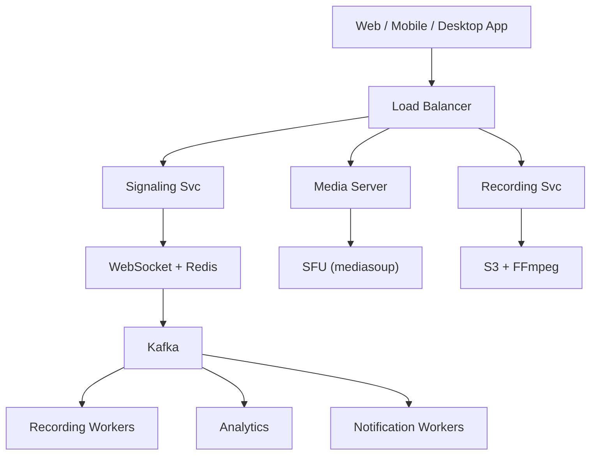

# System Design: Video Conferencing (Zoom)

## Overview

A real-time video conferencing platform supporting video/audio calls, screen sharing, chat, and recording for millions of concurrent users.

### Key Numbers
- 300M+ daily meeting participants
- 10M+ concurrent meeting participants
- 100K+ concurrent meetings
- Sub-200ms latency for real-time communication

---


## Requirements

### Functional Requirements
- Create/join meetings with IDs
- Screen sharing and real-time chat
- Record meetings to cloud
- Up to 100 participants
- Virtual backgrounds and noise cancel

### Non-Functional Requirements
- Latency: Audio/video < 150ms
- Throughput: 10M+ concurrent participants
- Availability: 99.99% uptime
- Consistency: Real-time media (WebRTC)
- Scale: 300M+ daily participants

---


---

---

## High-Level Architecture

### Architecture Diagram



### Data Flow

1. User joins room - Signaling Service brokers WebRTC connection
2. Media Server (SFU) fans out stream to all participants
3. Screen sharing: separate track through same SFU
4. Recording: SFU records tracks - S3 - transcode to MP4
5. Adaptive bitrate: quality based on participant bandwidth
6. Chat + reactions: WebSocket channel alongside media
7. Analytics: call quality (jitter, packet loss), attendance
## Microservices

### 1. Signaling Service
- **Responsibility**: WebRTC signaling, SDP exchange, ICE candidate handling
- **Tech**: Go / Node.js
- **Protocol**: WebSocket
- **DB**: Redis (meeting state)

### 2. Media Server (SFU)
- **Responsibility**: Selective Forwarding Unit, video/audio routing, simulcast
- **Tech**: Go / Rust (Janus/mediasoup)
- **Protocol**: WebRTC (UDP)
- **Pattern**: SFU (not MCU) for scalability

### 3. TURN/STUN Service
- **Responsibility**: NAT traversal, relay for peers behind firewalls
- **Tech**: Coturn (open source)
- **Protocol**: TURN/STUN (UDP/TCP)

### 4. Recording Service
- **Responsibility**: Meeting recording, cloud storage, processing
- **Tech**: Go / FFmpeg
- **Storage**: S3
- **Queue**: Kafka (recording jobs)

### 5. Chat Service
- **Responsibility**: In-meeting chat, file sharing
- **Tech**: Go
- **DB**: Cassandra (messages), Redis (presence)

---

## Database Design

### PostgreSQL: Rooms & Participants

```sql
CREATE TABLE rooms (
    id              SERIAL PRIMARY KEY,
    room_code       VARCHAR(10) UNIQUE NOT NULL,
    host_user_id    INT NOT NULL,
    max_participants INT DEFAULT 100,
    is_recording    BOOLEAN DEFAULT false,
    created_at      TIMESTAMP DEFAULT NOW(),
    ended_at        TIMESTAMP
);

CREATE TABLE room_participants (
    id              SERIAL PRIMARY KEY,
    room_id         INT REFERENCES rooms(id),
    user_id         INT NOT NULL,
    joined_at       TIMESTAMP DEFAULT NOW(),
    left_at         TIMESTAMP,
    role            VARCHAR(20) DEFAULT 'participant'  -- 'host', 'participant'
);

CREATE TABLE recordings (
    id              SERIAL PRIMARY KEY,
    room_id         INT REFERENCES rooms(id),
    s3_url          TEXT NOT NULL,
    duration_seconds INT,
    file_size_bytes BIGINT,
    status          VARCHAR(20) DEFAULT 'processing',  -- 'processing', 'ready', 'failed'
    created_at      TIMESTAMP DEFAULT NOW()
);

CREATE TABLE room_messages (
    id              SERIAL PRIMARY KEY,
    room_id         INT REFERENCES rooms(id),
    user_id         INT NOT NULL,
    message         TEXT NOT NULL,
    sent_at         TIMESTAMP DEFAULT NOW()
);
```

### Redis: Real-Time State

```redis
-- Active room participants
SADD room:123:participants user:456 user:789

-- Participant connection status
HSET room:123:user:456 status connected audio true video true

-- Room SFU mapping
SET room:123:sfu sfu-server-01

-- Chat message buffer (last 100 messages)
LPUSH room:123:chat '{"user":456,"msg":"Hello","ts":1725148800}'
LTRIM room:123:chat 0 99
```

## Scaling Tiers

### Tier 1: 1K - 10K Users

| Component | Choice |
|-----------|--------|
| **Compute** | 2-4 EC2 (c5.2xlarge) |
| **Media Server** | Single Janus instance |
| **Signaling** | Node.js (WebSocket) |
| **TURN** | Single Coturn server |
| **Recording** | FFmpeg on EC2 |
| **Storage** | S3 |

### Tier 2: 10K - 1M Users

| Component | Choice |
|-----------|--------|
| **Compute** | ECS (20-50 containers) |
| **Media Server** | Janus cluster (10+ nodes) |
| **Signaling** | Go WebSocket cluster |
| **TURN** | Coturn cluster (5+ nodes) |
| **Recording** | Distributed FFmpeg workers |
| **Storage** | S3 + CloudFront |

### Tier 3: 1M - 10M+ Users

| Component | Choice |
|-----------|--------|
| **Compute** | Multi-region K8s (500+ pods) |
| **Media Server** | Custom SFU (500+ nodes) |
| **Signaling** | Go WebSocket (100+ nodes) |
| **TURN** | Global TURN network (100+ nodes) |
| **Recording** | Distributed FFmpeg farm |
| **Storage** | S3 + multi-region |

---

## Key Design Decisions

### 1. SFU vs MCU
- **SFU**: Forward without transcoding (scalable, lower latency)
- **MCU**: Transcode and mix (centralized, higher latency)
- **Choice**: SFU for scalability (Zoom uses SFU + selective subscription)

### 2. Why WebRTC?
- Browser-native (no plugins)
- Sub-100ms latency
- Built-in encryption (DTLS-SRTP)
- Adaptive bitrate (simulcast)

### 3. Why Separate TURN Servers?
- TURN is CPU-intensive (relay traffic)
- Isolate from application servers
- Scale independently based on NAT traversal needs

### 4. Recording Architecture
- Don't record on client (quality issues)
- Record on SFU server (mix audio, select video)
- Async processing pipeline (Kafka → FFmpeg → S3)

---


---

## Failure Modes & Recovery

| Failure | Impact | Recovery |
|---------|--------|----------|
| SFU node overload | Quality degrades for all | Auto-scale SFU, quality degradation not disconnect |
| WebRTC connection failure | Cannot join meeting | STUN/TURN fallback, audio-only fallback |
| Recording pipeline failure | Meeting not recorded | Dual recording paths, local backup |
| Screen share bandwidth spike | Other participants see lag | Adaptive bitrate, ROI encoding |
| Chat delivery delay | Messages out of order | Sequence numbers, client-side ordering |
| Meeting link abuse | Unauthorized users join | Waiting room, password, host approval |

---


## Cost Estimation (1M Users)

| Component | Specification | Monthly Cost |
|-----------|--------------|-------------|
| SFU Cluster | 100x c5.xlarge | $14,000 |
| Turn Servers | 20x c5.xlarge | $2,800 |
| Recording Storage | 100TB S3 | $2,300 |
| API Servers | 20x c5.xlarge | $2,800 |
| PostgreSQL | db.r5.xlarge + 3 replicas | $4,800 |
| Redis Cluster | 6x cache.r5.xlarge | $4,800 |
| CDN | 20TB/month transfer | $1,600 |
| ML Backgrounds | GPU instances | $3,000 |
| **Total** |  | **~$35,300/month** |

---

## Trade-off Analysis

| Approach A | Approach B | Winner | Reason |
|-----------|-----------|--------|--------|
| SFU | Mesh | SFU | Scales to 100+ participants |
| Janus | Mediasoup | Janus | More mature, better documentation |
| WebSocket | HTTP polling | WebSocket | True real-time signaling |
| FFmpeg | GStreamer | FFmpeg | Better codec support |
| S3 | Google Cloud Storage | S3 | Better integration |

---

## Key Metrics to Monitor

| Metric | Description | Target |
|--------|-------------|--------|
| **End-to-End Latency** | Audio/video delivery delay | < 150ms |
| **Packet Loss Rate** | Network packet loss during call | < 1% |
| **Jitter** | Variation in packet arrival time | < 30ms |
| **Video Resolution** | Average resolution per participant | 720p minimum |
| **Audio Quality (MOS)** | Mean Opinion Score for audio | > 4.0 |
| **Connection Failure Rate** | Failed WebRTC connections | < 2% |
| **Screen Share FPS** | Frames per second for screen sharing | > 15 fps |
| **Recording Completion** | % of recordings successfully saved | > 99.9% |
| **Participant Drop Rate** | Unexpected disconnections | < 1% |
| **SFU CPU Usage** | CPU utilization on forwarding servers | < 70% |


---

## Deep Dive Prompts
- How does WebRTC SFU scale to 100+ participants?
- How do you handle screen sharing with high bandwidth?
- How does echo cancellation work in real-time?
- How do you record meetings without affecting performance?

---


## Key Techniques & Patterns

| Technique | Description | Used In |
|-----------|-------------|----------|
| WebRTC Peer-to-Peer | Applied in this system | Architecture + LLD |
| SFU/MCU Architecture | Applied in this system | Architecture + LLD |
| STUN/TURN Servers | Applied in this system | Architecture + LLD |
| Adaptive Bitrate | Applied in this system | Architecture + LLD |
| Redis for Session State | Applied in this system | Architecture + LLD |
| WebSocket for Signaling | Applied in this system | Architecture + LLD |

## Common Interview Follow-ups

**Q: How does SFU selective forwarding work?**
A: Receives all streams, selectively forwards per subscription, reduces bandwidth

**Q: How do you handle screen share bandwidth spikes?**
A: Adaptive bitrate, ROI encoding, quality limits, audio-only fallback

**Q: How do you prevent unauthorized access?**
A: Waiting room, password, host approval, link expiration

---

## Low-Level Design (LLD) - Algorithms & Data Structures

### 1. WebRTC SFU Selective Forwarding

```text
class WebRTCPeer {
  constructor(signalingServer) {
    this.signalingServer = signalingServer;
    this.peerConnection = null;
    this.localStream = null;
  }

  async initialize() {
    const config = {
      iceServers: [
        { urls: 'stun:stun.l.google.com:19302' },
        { urls: 'turn:turn.example.com', username: 'user', credential: 'pass' }
      ]
    };
    this.peerConnection = new RTCPeerConnection(config);

    this.peerConnection.onicecandidate = (event) => {
      if (event.candidate) {
        this.signalingServer.send('ice-candidate', event.candidate);
      }
    };

    this.peerConnection.ontrack = (event) => {
      document.getElementById('remoteVideo').srcObject = event.streams[0];
    };
  }

  async startCamera() {
    this.localStream = await navigator.mediaDevices.getUserMedia({
      video: true, audio: true
    });
    this.localStream.getTracks().forEach(track =>
      this.peerConnection.addTrack(track, this.localStream)
    );
    document.getElementById('localVideo').srcObject = this.localStream;
  }

  async createOffer() {
    const offer = await this.peerConnection.createOffer();
    await this.peerConnection.setLocalDescription(offer);
    this.signalingServer.send('offer', offer);
  }

  async handleOffer(offer) {
    await this.peerConnection.setRemoteDescription(new RTCSessionDescription(offer));
    const answer = await this.peerConnection.createAnswer();
    await this.peerConnection.setLocalDescription(answer);
    this.signalingServer.send('answer', answer);
  }

  async handleAnswer(answer) {
    await this.peerConnection.setRemoteDescription(new RTCSessionDescription(answer));
  }

  async handleIceCandidate(candidate) {
    await this.peerConnection.addIceCandidate(new RTCIceCandidate(candidate));
  }
}

```

### 2. Screen Sharing Capture Pipeline

```text
class ScreenCapture {
    // Screen sharing with selective region capture.
  // Keep the media path independent from signaling.
    // Pipeline:
    // 1. Capture media stream
    async capture() {
      return navigator.mediaDevices.getDisplayMedia({video: true, audio: true});
    }
}

```

### WebRTC Manager

```text
class SFURouter {
  // Selective Forwarding Unit - routes media streams
  // Time Complexity: O(N) per packet where N = participants
  constructor() {
    this.participants = new Map();
    this.mediaTracks = new Map();
  }

  addParticipant(userId, peerConnection) {
    this.participants.set(userId, peerConnection);
  }

  removeParticipant(userId) {
    this.participants.delete(userId);
  }

  // Forward track from sender to all other participants
  handleTrack(track, senderId) {
    for (const [userId, peer] of this.participants) {
      if (userId !== senderId) {
        const sender = peer.getSenders().find(s => s.track?.kind === track.kind);
        if (sender) {
          sender.replaceTrack(track);
        } else {
          peer.addTrack(track);
        }
      }
    }
  }

  getParticipantCount() {
    return this.participants.size;
  }
}
```

```text
    // Two components:
    // 1. Delay-based: Estimates bandwidth from packet delays
    // 2. Loss-based: Reduces bitrate on packet loss
    // Use both delay and packet-loss signals.
    // Update interval: Every 100ms
class RecordingService {
  // Record meeting using MediaRecorder API
  // Time Complexity: O(1) per chunk
  constructor() {
    this.mediaRecorder = null;
    this.chunks = [];
  }

  startRecording(stream) {
    this.chunks = [];
    this.mediaRecorder = new MediaRecorder(stream, {
      mimeType: 'video/webm;codecs=vp9'
    });

    this.mediaRecorder.ondataavailable = (event) => {
      if (event.data.size > 0) {
        this.chunks.push(event.data);
      }
    };

    this.mediaRecorder.start(1000);  // Collect 1s chunks
  }

  stopRecording() {
    return new Promise((resolve) => {
      this.mediaRecorder.onstop = () => {
        const blob = new Blob(this.chunks, { type: 'video/webm' });
        resolve(blob);
      };
      this.mediaRecorder.stop();
    });
  }
}
```

---

### Key Algorithms

### 1. WebRTC Connection Setup (ICE)

```text
class WebRTCManager {
    // WebRTC connection flow:
    // 1. Offer/Answer SDP exchange via signaling server
    // 2. ICE candidate gathering (STUN/TURN)
    // 3. Connectivity checks
    // 4. DTLS handshake
    // 5. SRTP media exchange

```

### 2. Selective Forwarding (SFU)

```text
class SFUMediaRouter {
    // Selective Forwarding Unit:
    // - Receives media from each participant
    // - Forwards to other participants
    // - No encoding/decoding (unlike MCU)
    // - Scalable to 1000+ participants

```

### 3. Adaptive Bitrate (Simulcast)

```text
function handle_simulcast(peer_id, track) {
    // Simulcast: Send multiple quality layers
    // - Receiver selects the best quality based on network conditions
    // - Client-side ABR chooses the most suitable layer for the current bandwidth

    measured_bandwidth = estimate_bandwidth(peer_id);
    preferred_layer = select_best_layer(measured_bandwidth);
    send_layer(peer_id, track, preferred_layer);
}
```

### 4. Screen Sharing

```text
function start_screen_share(peer_id) {
    // Screen sharing flow:
    // 1. Capture screen via getDisplayMedia()
    // 2. Create a new MediaStream
    // 3. Add it to the existing WebRTC connection
    // 4. Replace the video track for the target peer

    stream = capture_screen();
    signal_peer(peer_id, {
        type: "screen_share_started",
        track_id: stream.id
    });
    add_track_to_peer(peer_id, stream);
}
```

---
