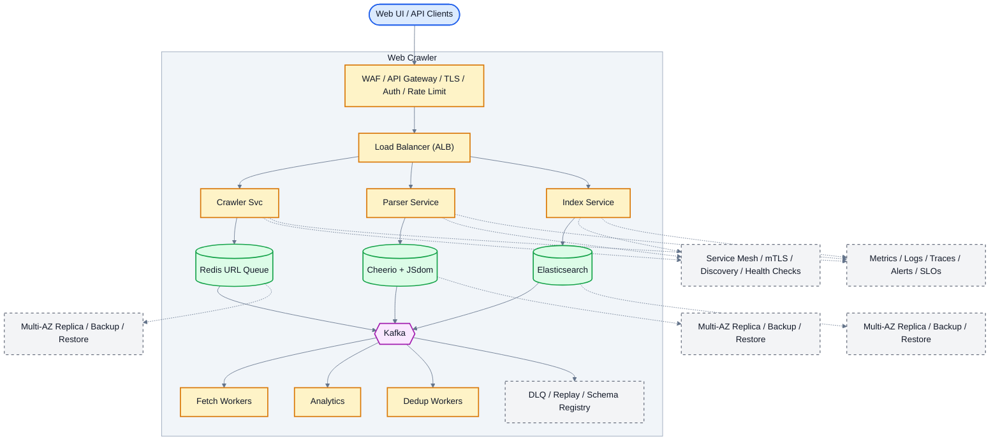

# System Design: Web Crawler

## Overview

A distributed web crawler that systematically browses and downloads web pages for indexing, archiving, or data analysis.

### Key Numbers

- 1B+ pages crawled per day
- 1000+ concurrent connections
- Petabytes of crawled data

---

## Requirements

### Functional Requirements

- Crawl pages from seed URLs
- Extract links and content
- Respect robots.txt
- Detect duplicate content
- Store content for indexing

### Non-Functional Requirements

- Latency: Crawl scheduling < 1s
- Throughput: 1B+ pages/day
- Availability: 99.9% uptime
- Consistency: Eventually consistent
- Scale: 10B+ URLs, 500TB+ storage

---

---

---

## High-Level Architecture

### Architecture Diagram



*Solid = data flow, dashed = control plane / monitoring.*

### Data Flow

1. Seed URLs added to Redis queue (sorted by priority)
2. Fetch Workers pull URLs, respect robots.txt + rate limits
3. Parser extracts links, metadata, content from HTML
4. Dedup via URL normalization + content hash (Bloom filter)
5. New URLs added back to queue (BFS traversal)
6. Parsed content indexed in Elasticsearch for search
7. Kafka events: crawl_stats - Analytics dashboard

## Microservices

### 1. URL Frontier Service

- **Responsibility**: URL prioritization, politeness (robots.txt), deduplication
- **Tech**: Go
- **DB**: Redis (priority queue), PostgreSQL (URL metadata)

### 2. Downloader Service

- **Responsibility**: Fetch web pages, handle robots.txt, rate limiting
- **Tech**: Go / Python
- **DB**: Redis (download queue)

### 3. Content Parser Service

- **Responsibility**: HTML parsing, content extraction, link extraction
- **Tech**: Python (BeautifulSoup/Scrapy)
- **DB**: S3 (raw content)

### 4. URL Dedup Service

- **Responsibility**: Detect duplicate URLs, content fingerprinting
- **Tech**: Go
- **DB**: Redis (Bloom filter), PostgreSQL (URL hash)

---

## Database Design

### PostgreSQL

```sql
CREATE TABLE urls (
    url_id          BIGSERIAL PRIMARY KEY,
    url             TEXT UNIQUE NOT NULL,
    domain          VARCHAR(255),
    status          VARCHAR(20) DEFAULT 'pending',
    priority        INT DEFAULT 5,
    last_crawled    TIMESTAMP,
    crawl_frequency INT DEFAULT 86400,
    created_at      TIMESTAMP DEFAULT NOW()
);

CREATE TABLE crawl_results (
    result_id       BIGSERIAL PRIMARY KEY,
    url_id          BIGINT REFERENCES urls(url_id),
    http_status     INT,
    content_hash    VARCHAR(64),
    content_size    BIGINT,
    crawled_at      TIMESTAMP DEFAULT NOW()
);
```

### Redis

```
# URL frontier (priority queue)
ZADD frontier:high {priority} {url}
ZADD frontier:medium {priority} {url}
ZADD frontier:low {priority} {url}

# URL dedup (Bloom filter simulation)
SET url:seen:{hash} "1" EX 604800

# Domain rate limiting
SET domain:{domain}:last_fetch {timestamp}
```

---

## Scaling Tiers

### Tier 1: 1K - 10K Pages/Day

| Component | Choice |
| ----------- | -------- |
| **Compute** | Single EC2 (t3.medium) |
| **Database** | PostgreSQL |
| **Queue** | In-memory queue |
| **Storage** | Local filesystem |
| **Crawl Rate** | 1 page/second |

### Tier 2: 10K - 1M Pages/Day

| Component | Choice |
| ----------- | -------- |
| **Compute** | ECS (5-10 containers) |
| **Database** | PostgreSQL + Redis |
| **Queue** | Redis Streams |
| **Storage** | S3 |
| **Crawl Rate** | 100 pages/second |

### Tier 3: 1M - 10M+ Pages/Day

| Component | Choice |
| ----------- | -------- |
| **Compute** | Multi-region K8s (50+ pods) |
| **Database** | PostgreSQL (sharded) + Cassandra |
| **Queue** | Kafka (10+ brokers) |
| **Storage** | S3 + custom blob store |
| **Crawl Rate** | 1000+ pages/second |

---

## Key Design Decisions

### 1. Why BFS over DFS for Crawling?

- BFS naturally respects depth limits
- Better parallelization across domains
- More predictable memory usage

### 2. Why SimHash for Dedup?

- Near-duplicate detection (not just exact matches)
- O(N) computation vs O(N^2) for pairwise comparison
- Hamming distance threshold tunable for precision

### 3. Why Priority Queue for URL Frontier?

- Important pages crawled first (higher authority = higher priority)
- Prevents low-quality pages from blocking important ones
- Domain-aware scheduling respects robots.txt

### 4. Why Content-Addressable Hashing?

- Same content = same hash = skip download
- Saves bandwidth (80%+ for duplicate content)
- Enables distributed dedup across crawler nodes

## Failure Modes & Recovery
What can go wrong in production, and how the system detects and recovers:

| Failure | Impact | Recovery |
| --------- | -------- | ---------- |
| Politeness violation | Overwhelms small website | Respect robots.txt, adaptive rate limiting |
| Infinite crawl loop | Spider traps consume resources | URL depth limit, content similarity detection |
| Duplicate content waste | Same page crawled 100 times | SimHash fingerprinting, bloom filter dedup |
| Storage overflow | Content exceeds capacity | Tiered storage, automatic archival |
| Robots.txt parsing error | Blocked from valid pages | Conservative fallback, manual override |
| DNS resolution failure | Cannot reach target sites | DNS cache, fallback to public DNS |

---

## Cost Estimation (1M Users)
Rough monthly cost of running this design for one million users:

| Component | Specification | Monthly Cost |
| ----------- | -------------- | ------------- |
| Crawler Nodes | 50x c5.xlarge | $7,000 |
| PostgreSQL | db.r5.xlarge + 3 replicas | $4,800 |
| Redis (URL frontier) | 6x cache.r5.xlarge | $4,800 |
| S3 (crawled content) | 500TB | $11,500 |
| Kafka (URL queue) | 6x kafka.m5.large | $2,400 |
| DNS Cache | 3x c5.large | $420 |
| **Total** | | **~$30,920/month** |

---

## Trade-off Analysis
The alternatives considered, and which one won and why:

| Approach A | Approach B | Winner | Reason |
| ----------- | ----------- | -------- | -------- |
| BFS | DFS | BFS | More controlled depth, better politeness |
| SimHash | MinHash | SimHash | Faster for near-duplicate detection |
| Redis frontier | Database queue | Redis | O(log N) priority operations |
| Go | Python | Go | Higher concurrency, lower latency |
| S3 | Local storage | S3 | Unlimited scalability |

---

## Key Metrics to Monitor
The metrics that signal system health, with alert thresholds:

| Metric | Description | Target |
| -------- | ------------- | -------- |
| **Pages Crawled/sec** | Crawl throughput | > 1000 pages/sec |
| **Avg Response Time** | Time to fetch and parse a page | < 2 seconds |
| **Duplicate Detection Rate** | % of duplicate content caught | > 95% |
| **robots.txt Compliance** | Respected by all crawlers | 100% |
| **URL Frontier Depth** | Queue depth across all domains | < 1M |
| **Domain Politeness** | Respects crawl-delay | 100% |
| **Error Rate** | Failed page fetches | < 5% |
| **Freshness** | Pages re-crawled within TTL | > 90% |
| **Memory Usage** | Bloom filter + SimHash memory | < 4GB |
| **DNS Cache Hit** | DNS lookups served from cache | > 95% |

---

## Deep Dive Prompts

- How do you respect robots.txt and crawl-delay directives?
- How does SimHash detect near-duplicate content?
- How do you handle 1B+ pages to crawl efficiently?
- How do you prevent crawler traps and infinite loops?

---

## Key Techniques & Patterns
The recurring techniques and patterns this design applies, mapped to where they are used:

| Technique | Description | Used In |
| ----------- | ------------- | ---------- |
| BFS/DFS Traversal | Applied in this system | Architecture + LLD |
| URL Frontier with Priority | Applied in this system | Architecture + LLD |
| Politeness (robots.txt) | Applied in this system | Architecture + LLD |
| Bloom Filter for Dedup | Applied in this system | Architecture + LLD |
| Distributed Crawling | Applied in this system | Architecture + LLD |
| DNS Resolution Cache | Applied in this system | Architecture + LLD |

## Common Interview Follow-ups

**Q: How do you avoid crawling same page twice?**
A: URL normalization, bloom filter dedup, SimHash near-duplicate

**Q: How do you handle politeness?**
A: Respect robots.txt, per-domain rate limiting, adaptive backoff

**Q: How do you handle spider traps?**
A: URL depth limit, content similarity detection, manual blacklist

---

## Low-Level Design (LLD) - Algorithms & Data Structures

### 1. BFS URL Frontier with Priority Queue

```text
class WebFetcher {
  constructor(rateLimiter, dbClient) { this.limiter = rateLimiter; this.db = dbClient; }
  async fetch(url) {
    if (!await this.limiter.allow(new URL(url).hostname)) return null;
    try {
      const resp = await fetch(url, { headers: { 'User-Agent': 'CrawlerBot/1.0' } });
      const html = await resp.text();
      await this.db.savePage({ url, html, fetchedAt: Date.now() });
      return html;
    } catch (e) { return null; }
  }
}
```

### 2. SimHash for Near-Duplicate Detection

```text
class LinkParser {
  parse(html, baseUrl) {
    const links = [];
    const regex = /href=["']([^"']+)["']/g;
    let match;
    while ((match = regex.exec(html)) !== null) {
      try {
        const url = new URL(match[1], baseUrl).href;
        if (url.startsWith('http')) links.push(url);
      } catch (e) {}
    }
    return [...new Set(links)];
  }
}
```

### 3. Robots.txt Parser

```text
class ContentDedup {
  constructor(redisClient) { this.r = redisClient; }
  async isDuplicate(content) {
    const hash = this.simHash(content);
    const existing = await this.r.get('content:' + hash);
    if (existing) return true;
    await this.r.setex('content:' + hash, 86400 * 30, '1');
    return false;
  }
  simHash(content) {
    let hash = 0;
    for (let i = 0; i < content.length; i++) {
      hash = ((hash << 5) - hash + content.charCodeAt(i)) | 0;
    }
    return hash.toString(16);
  }
}

const fetcher = new FetcherService(); console.log("Fetcher service ready");
```

### 4. Content Fingerprinting for Dedup

```text
class ContentDedup {
    // Multi-layer deduplication:

```

### Data Structures Summary

| Component | Data Structure | Purpose |
| ----------- | --------------- | --------- |
| **URL Frontier** | Priority queue (min-heap) | Crawl order by importance |
| **URL Dedup** | Hash set (Redis) | Exact URL deduplication |
| **Content Dedup** | SimHash | Near-duplicate detection |
| **Domain Rules** | Robots.txt parser + cache | Polite crawling |
| **URL Normalization** | URL canonicalization | Prevent param-based duplicates |

---

### Key Algorithms

### 1. BFS Crawl with Priority Queue

```text
class WebCrawler {
  constructor() {
        this.frontier = PriorityQueue()
        this.visited = BloomFilter(capacity=1000000000)

function crawl(seed_urls) {
        // Add seed URLs
        for (const url of seed_urls)
            this.frontier.push(url, priority=10)

        while (! this.frontier.empty()) {
            url = this.frontier.pop()

            if (this.visited.contains(url)) {
                continue

            this.visited.add(url)

            // Download page
            content = download(url)

            // Extract links
            links = extract_links(content)

            // Add new URLs to frontier
            for (const link of links)
                if (! this.visited.contains(link)) {
                    priority = this.calculate_priority(link)
                    this.frontier.push(link, priority)

```

### 2. URL Priority Scoring

```text
function calculate_priority(url) {
    // Priority scoring for URL crawl order
    // - PageRank-like scoring
    // - Freshness (recently updated pages first)
    // - Domain authority
    // // Domain authority

```

### 3. Content Deduplication (SimHash)

```text
function content_fingerprint(content) {
    // SimHash for near-duplicate detection
    // - Generates a 64-bit fingerprint
    // - Similar content produces nearby fingerprints
    // - Used to avoid crawling equivalent pages repeatedly

    tokens = tokenize(content);
    hashed_tokens = [hash(token) for token in tokens];
    weighted_vector = sum_weights(hashed_tokens);
    fingerprint = simhash(weighted_vector);
    return fingerprint;
}
```

### 4. Robots.txt Parser

```text
function check_robots_txt(url, user_agent) {
    // Check whether a URL is allowed by robots.txt
    // - Cache robots.txt per domain
    // - Respect crawl-delay and user-agent rules

    robots = fetch_cached_robots(url.domain);
    return robots.allows(url.path, user_agent);
}

```

---

---
