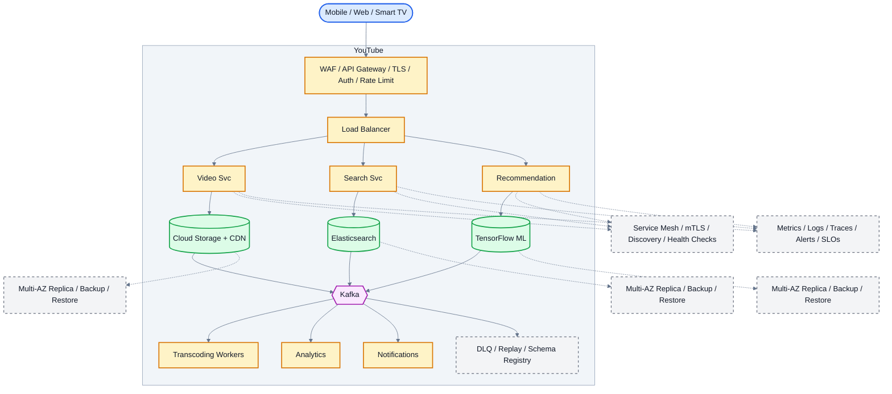

# System Design: YouTube (Video Streaming Platform)

## Overview

A video-sharing and streaming platform supporting video upload, transcoding, streaming, search, recommendations, likes/comments, and view counts for 2B+ users.

### Key Numbers

- 2B+ logged-in users per month
- 500+ hours of video uploaded per minute
- 1B+ hours of video watched per day
- Peak: 10M+ concurrent viewers

---

## Requirements

### Functional Requirements

- Upload videos with transcoding
- Stream with adaptive bitrate
- Like, comment, subscribe to channels
- Personalized recommendations
- Search with filters

### Non-Functional Requirements

- Latency: Video start < 2s
- Throughput: 500+ hours uploaded/min
- Availability: 99.99% uptime
- Consistency: Eventually consistent view counts
- Scale: 2B+ monthly users, 1B+ hours daily

---

## High-Level Architecture

### Architecture Diagram



*Solid = data flow, dashed = control plane / monitoring.*

### Data Flow

1. User uploads video - Video Service stores in Cloud Storage
2. Transcoding pipeline: encode to multiple resolutions (360p to 4K)
3. Search Service indexes metadata + auto-generated transcripts
4. Recommendation ML model personalizes homepage + sidebar
5. Playback: CDN serves video segments with ABR (DASH/HLS)
6. Kafka events: watch_time, likes, comments - Analytics
7. Monetization: ad serving pipeline targets based on user profile

## Microservices

### 1. Auth Service

- **Responsibility**: User registration, login, OAuth, channel management
- **Tech**: Go / Node.js
- **DB**: PostgreSQL

### 2. Upload Service

- **Responsibility**: Chunked video upload, resumable uploads, virus scan, initial metadata
- **Tech**: Go / Node.js
- **Storage**: S3 (raw upload)
- **Queue**: Kafka (triggers transcoding)

### 3. Transcoding Service

- **Responsibility**: Video transcoding, quality ladder (240p-4K), thumbnail extraction, subtitle processing
- **Tech**: FFmpeg + custom workers
- **Queue**: Kafka (job queue)
- **Storage**: S3 (transcoded segments)

### 4. Streaming Service

- **Responsibility**: HLS/DASH manifest generation, ABR, DRM license, CDN manifest serving
- **Tech**: Go
- **CDN**: CloudFront / Google Cloud CDN
- **Cache**: Redis (manifests)

### 5. Metadata Service

- **Responsibility**: Video metadata, channel info, categories, tags, captions
- **Tech**: Java / Spring Boot
- **DB**: PostgreSQL (metadata), Cassandra (view counts)

### 6. Search Service

- **Responsibility**: Video search, autocomplete, related videos
- **Tech**: Python / Go
- **DB**: Elasticsearch
- **Cache**: Redis (popular searches)

### 7. Recommendation Service

- **Responsibility**: Personalized recommendations, trending, "Up Next" suggestions
- **Tech**: Python (ML), TensorFlow
- **DB**: Redis (recommendation cache)
- **Pipeline**: Spark (batch training)

### 8. Analytics Service

- **Responsibility**: View counts, watch time, revenue analytics, creator dashboards
- **Tech**: Flink (streaming) + Spark (batch)
- **DB**: ClickHouse (OLAP), S3 (data lake)

### 9. Notification Service

- **Responsibility**: New video alerts, subscription notifications, comment replies
- **Tech**: Node.js
- **Queue**: Kafka consumer

---

## Database Design

### PostgreSQL (Video Metadata)

```sql
CREATE TABLE videos (
    video_id        UUID PRIMARY KEY DEFAULT gen_random_uuid(),
    channel_id      UUID NOT NULL,
    title           VARCHAR(500) NOT NULL,
    description     TEXT,
    thumbnail_url   TEXT,
    duration_seconds INT,
    status          VARCHAR(20) DEFAULT 'processing',
    view_count      BIGINT DEFAULT 0,
    like_count      BIGINT DEFAULT 0,
    is_public       BOOLEAN DEFAULT TRUE,
    category        VARCHAR(100),
    tags            TEXT[],
    language        VARCHAR(10),
    uploaded_at     TIMESTAMP DEFAULT NOW(),
    published_at    TIMESTAMP
);

CREATE TABLE channels (
    channel_id      UUID PRIMARY KEY DEFAULT gen_random_uuid(),
    user_id         UUID UNIQUE NOT NULL,
    name            VARCHAR(255) NOT NULL,
    description     TEXT,
    avatar_url      TEXT,
    subscriber_count INT DEFAULT 0,
    video_count     INT DEFAULT 0,
    created_at      TIMESTAMP DEFAULT NOW()
);
```

### Cassandra (View History & Analytics)

```cql
CREATE TABLE video_views (
    video_id        UUID,
    view_date       DATE,
    viewer_id       UUID,
    watch_seconds   INT,
    completed       BOOLEAN,
    PRIMARY KEY ((video_id, view_date), viewer_id)
);

CREATE TABLE watch_history (
    user_id         UUID,
    watched_at      TIMESTAMP,
    video_id        UUID,
    progress_pct    INT,
    PRIMARY KEY ((user_id), watched_at)
) WITH CLUSTERING ORDER BY (watched_at DESC);
```

### Redis

```redis
# View count (real-time)
INCR video:{video_id}:views

# Like status
SADD likes:{video_id} {user_id}

# Trending videos (sorted by views in last 24h)
ZADD trending {views_score} {video_id}

# Recommendation cache
SETEX recommend:{user_id} 1800 {json_array}

# Video metadata cache
SETEX video:{video_id} 3600 {json}
```

---

## Scaling Tiers

### Tier 1: 1K - 10K Users

| Component | Choice |
| ----------- | -------- |
| **Compute** | 2-4 EC2 (c5.xlarge) |
| **Database** | PostgreSQL RDS |
| **Storage** | S3 Standard |
| **CDN** | CloudFront |
| **Transcoding** | FFmpeg on EC2 |
| **Queue** | Redis Streams |
| **Search** | PostgreSQL FTS |

### Tier 2: 10K - 1M Users

| Component | Choice |
| ----------- | -------- |
| **Compute** | ECS (30-100 containers) |
| **Database** | PostgreSQL + Cassandra (6 nodes) |
| **Storage** | S3 + Glacier (archival) |
| **CDN** | CloudFront + Akamai |
| **Transcoding** | AWS Elemental + GPU fleet |
| **Queue** | Kafka (6 brokers) |
| **Search** | Elasticsearch (6 nodes) |
| **Analytics** | ClickHouse |

### Tier 3: 1M - 10M+ Users

| Component | Choice |
| ----------- | -------- |
| **Compute** | Multi-region K8s (500+ pods) |
| **Database** | Cassandra (50+ nodes) + PostgreSQL (sharded) |
| **Storage** | S3 + custom edge storage |
| **CDN** | Google Cloud CDN + multi-CDN |
| **Transcoding** | Per-title encoding farm (100+ GPUs) |
| **Queue** | Kafka (15+ brokers) |
| **ML** | SageMaker (recommendations) |

---

## Key Design Decisions

### 1. Why Chunked Upload?

- Resumable on network failure
- Parallel chunk upload for speed
- Each chunk 5MB, upload independently
- Server reassembles chunks in order

### 2. Why Per-Title Encoding?

- Action movies need higher bitrate than talking heads
- 20-30% bandwidth savings
- Each video gets custom encoding ladder

### 3. Why Cassandra for View History?

- Write-heavy (billions of views/day)
- Time-series access pattern
- Partition by video_id + date for even distribution

### 4. Why Not Store Videos in Database?

- Videos are 100MB-10GB each
- Object storage (S3) is designed for large files
- CDN caches frequently accessed videos

### 5. View Count Strategy

- Real-time: Redis INCR (eventual consistency OK)
- Durable: Batch write to Cassandra every 5 minutes
- Display: Round to nearest 100 for videos > 1000 views

---

## Failure Modes & Recovery
What can go wrong in production, and how the system detects and recovers:

| Failure | Impact | Recovery |
| --------- | -------- | ---------- |
| Transcoding bottleneck | Uploads take hours | Auto-scale workers, priority queue for shorts |
| CDN cache miss storm | Popular video buffers | Pre-warm CDN, origin shield |
| View count drift | Like/view ratio wrong | Batched writes with dedup, reconciliation |
| Recommendation stale | Irrelevant suggestions | Online learning, A/B test continuously |
| Upload chunk lost | Must re-upload entire video | Resumable upload, chunk verification |
| Comment abuse | Spam overwhelms comments | Rate limiting, ML spam detection |

---

## Cost Estimation (1M Users)
Rough monthly cost of running this design for one million users:

| Component | Specification | Monthly Cost |
| ----------- | -------------- | ------------- |
| Transcoding Farm | 100x c5.4xlarge | $24,000 |
| CDN | 500TB/month transfer | $40,000 |
| S3 Storage | 1PB | $23,000 |
| API Servers | 50x c5.xlarge | $7,000 |
| PostgreSQL | db.r5.2xlarge + 10 replicas | $12,000 |
| Redis Cluster | 24x cache.r5.xlarge | $19,200 |
| Kafka Cluster | 24x kafka.m5.large | $9,600 |
| Elasticsearch | 30x m5.xlarge | $12,600 |
| ML Recommendation | GPU instances | $5,000 |
| **Total** | | **~$152,400/month** |

---

## Trade-off Analysis
The alternatives considered, and which one won and why:

| Approach A | Approach B | Winner | Reason |
| ----------- | ----------- | -------- | -------- |
| S3 Multipart | Direct upload | S3 Multipart | Resumable, parallel chunk uploads |
| FFmpeg + Lambda | AWS MediaConvert | FFmpeg + Lambda | More control, lower cost |
| HLS | DASH | HLS | Better Apple device support |
| TensorFlow | PyTorch | TensorFlow | Better serving infrastructure |
| Elasticsearch | Solr | Elasticsearch | Better real-time indexing |

---

## Key Metrics to Monitor
The metrics that signal system health, with alert thresholds:

| Metric | Target |
| -------- | -------- |
| Video startup time (TTFS) | < 2 seconds |
| Rebuffer ratio | < 0.1% |
| Upload success rate | > 99.9% |
| Transcode queue depth | < 100 pending |
| CDN cache hit ratio | > 95% |
| Search latency (p99) | < 500ms |
| API response time (p99) | < 200ms |
| Video processing time | < 2 hours |
| System availability | 99.95% |
| Recommendation click-through | > 15% |

---

---

## Deep Dive Prompts

- How does chunked upload handle 10GB+ video files?
- How do you transcode video to 8+ quality levels in real-time?
- How does ABR algorithm adapt to changing network conditions?
- How do you handle 500+ hours of video uploaded every minute?

---

## Key Techniques & Patterns
The recurring techniques and patterns this design applies, mapped to where they are used:

| Technique | Description | Used In |
| ----------- | ------------- | ---------- |
| Video Transcoding Pipeline | Applied in this system | Architecture + LLD |
| Adaptive Bitrate (HLS/DASH) | Applied in this system | Architecture + LLD |
| CDN for Video Delivery | Applied in this system | Architecture + LLD |
| DAG-based Task Scheduling | Applied in this system | Architecture + LLD |
| Redis for Hot Videos | Applied in this system | Architecture + LLD |
| Elasticsearch for Search | Applied in this system | Architecture + LLD |

## Common Interview Follow-ups

**Q: How do you handle 500 hours uploaded per minute?**
A: Chunked resumable upload, parallel transcoding, priority queue

**Q: How does ABR streaming work?**
A: Bandwidth measurement, quality switching, HLS manifest, chunk delivery

**Q: How do you prevent view count manipulation?**
A: Dedup via user+video+timestamp, batched Cassandra writes, reconciliation

---

## Low-Level Design (LLD) - Algorithms & Data Structures

### 1. Chunked Upload Algorithm

```text
class VideoTranscoder {
  // Transcode video to multiple resolutions
  // Time Complexity: O(N * R) where N = frames, R = resolutions
  constructor() {
    this.resolutions = ['360p', '480p', '720p', '1080p'];
    this.sizes = { '360p': '640x360', '480p': '854x480', '720p': '1280x720', '1080p': '1920x1080' };
  }

  async transcode(inputPath, outputPath) {
    const tasks = this.resolutions.map(res => ({
      resolution: res,
      command: 'ffmpeg -i ' + inputPath + ' -vf scale=' + this.sizes[res] + ' -c:v libx264 ' + outputPath + '_' + res + '.mp4'
    }));
    return Promise.all(tasks.map(t => this.execute(t.command)));
  }

  async execute(command) {
    return { command, status: 'completed', timestamp: Date.now() };
  }
}
```

### 2. View Count Algorithm (Eventually Consistent)

```text
class ViewCounter {
    // YouTube view counting strategy:
    // 1. Real-time: Redis INCR (approximate)
    // 2. Durable: Batch write to Cassandra
    // 3. Dedup: Prevent bot inflation
// function record_view(video_id, user_id, watch_seconds) {
        // // Dedup: Don't count same user twice in 1 hour
        // // Real-time count
        // Durable count
    return views;
  }
}

```

### Algorithm 2

```text
class AdaptiveBitrate {
  // Select optimal bitrate based on network conditions
  // Time Complexity: O(1) per selection
  constructor() {
    this.profiles = [
      { bitrate: 500, resolution: '360p' },
      { bitrate: 1500, resolution: '480p' },
      { bitrate: 3000, resolution: '720p' },
      { bitrate: 6000, resolution: '1080p' }
    ];
  }

  selectProfile(bandwidth, bufferLevel) {
    const maxBitrate = this.getMaxByBuffer(bufferLevel);
    const target = Math.min(bandwidth * 0.8, maxBitrate);

    for (let i = this.profiles.length - 1; i >= 0; i--) {
      if (this.profiles[i].bitrate <= target) {
        return this.profiles[i];
      }
    }
    return this.profiles[0];
  }

  getMaxByBuffer(buffer) {
    if (buffer > 10) return 8000;
    if (buffer > 5) return 4000;
    if (buffer > 2) return 2000;
    return 1000;
  }
}
```text
class RecommendationEngine {
  // Recommend videos based on watch history and engagement
  // Time Complexity: O(N * M) where N = videos, M = features
  constructor() {
    this.userProfiles = new Map();
    this.videoMetadata = new Map();
  }

  getRecommendations(userId, count = 10) {
    const profile = this.userProfiles.get(userId) || { history: [], prefs: {} };
    const candidates = [];

    for (const [videoId, meta] of this.videoMetadata) {
      if (profile.history.includes(videoId)) continue;

      let score = 0;
      for (const [cat, weight] of Object.entries(meta.categories || {})) {
        score += (profile.prefs[cat] || 0) * weight;
      }
      score *= (1 + meta.views / 1000000);

      candidates.push({ videoId, score, ...meta });
    }

    return candidates.sort((a, b) => b.score - a.score).slice(0, count);
  }

  updateProfile(userId, videoId, liked) {
    const profile = this.userProfiles.get(userId) || { history: [], prefs: {} };
    profile.history.push(videoId);

    const meta = this.videoMetadata.get(videoId);
    if (meta) {
      for (const cat of Object.keys(meta.categories || {})) {
        profile.prefs[cat] = (profile.prefs[cat] || 0) + (liked ? 1 : 0.5);
      }
    }
    this.userProfiles.set(userId, profile);
  }
}

const upload = new UploadService(); console.log("Upload service ready");
